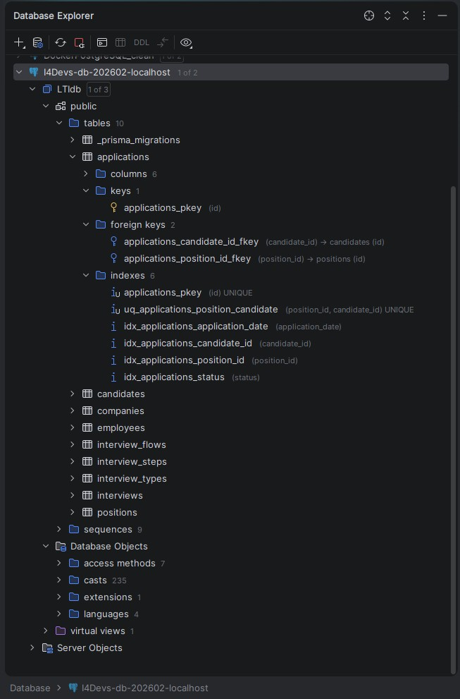
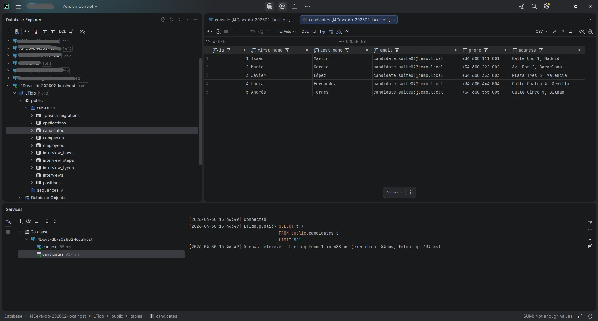

# PROMPT 1: Diseño de base de datos ATS y Prisma
_Exported on 4/30/2026 at 15:39:27 UTC from Cursor (3.2.16)_

---

**User**

Para el desarrollo del modelo de datos de un sistema ATS (Applicant-Tracking System), disponemos del diagrama ERD adjunto (imagen adjunta y diagrama mermaid):

erDiagram
     COMPANY {
         int id PK
         string name
     }
     EMPLOYEE {
         int id PK
         int company_id FK
         string name
         string email
         string role
         boolean is_active
     }
     POSITION {
         int id PK
         int company_id FK
         int interview_flow_id FK
         string title
         text description
         string status
         boolean is_visible
         string location
         text job_description
         text requirements
         text responsibilities
         numeric salary_min
         numeric salary_max
         string employment_type
         text benefits
         text company_description
         date application_deadline
         string contact_info
     }
     INTERVIEW_FLOW {
         int id PK
         string description
     }
     INTERVIEW_STEP {
         int id PK
         int interview_flow_id FK
         int interview_type_id FK
         string name
         int order_index
     }
     INTERVIEW_TYPE {
         int id PK
         string name
         text description
     }
     CANDIDATE {
         int id PK
         string firstName
         string lastName
         string email
         string phone
         string address
     }
     APPLICATION {
         int id PK
         int position_id FK
         int candidate_id FK
         date application_date
         string status
         text notes
     }
     INTERVIEW {
         int id PK
         int application_id FK
         int interview_step_id FK
         int employee_id FK
         date interview_date
         string result
         int score
         text notes
     }

     COMPANY ||--o{ EMPLOYEE : employs
     COMPANY ||--o{ POSITION : offers
     POSITION ||--|| INTERVIEW_FLOW : assigns
     INTERVIEW_FLOW ||--o{ INTERVIEW_STEP : contains
     INTERVIEW_STEP ||--|| INTERVIEW_TYPE : uses
     POSITION ||--o{ APPLICATION : receives
     CANDIDATE ||--o{ APPLICATION : submits
     APPLICATION ||--o{ INTERVIEW : has
     INTERVIEW ||--|| INTERVIEW_STEP : consists_of
     EMPLOYEE ||--o{ INTERVIEW : conducts

En base al proyecto actual y el modelo ER proporcionado, necesito que realices lo siguiente para una base de datos PostgreSQL:
- Transforma el ERD proporcionado en un script SQL.
- Aplica buenas prácticas de bases de datos relacionales.
- Usa los tipos de datos correctos.
- Usa normalización y 3NF siempre que sea posible.
- En base a las relaciones del modelo, define las claves PK y FK oportunas. 
- Idem con los índices.
- Idem con las restricciones y checks.

Una vez diseñado el modelo, genera el schema Prisma ORM correspondiente y escríbelo en "backend/prisma/schema.prisma" y prepara los comandos para la migración "prisma migrate dev".

Al terminar revisa que la configuración tenga tdo lo necesario para lanzar la migración de Prisma a la base de datos (no la ejecutes).

---

**Cursor**

Revisando el proyecto y el schema Prisma actual para generar el SQL y el schema alineados con el ERD.

Creando el script SQL de referencia y el `schema.prisma` del ATS. La interpolación `${DB_USER}` en `DATABASE_URL` suele no expandirse al cargar `.env` con Prisma; lo indicaré en la revisión.

Corrigiendo el mapeo redundante en `Company` y validando el schema con Prisma.

Añadiendo scripts npm para las migraciones y comprobando que `prisma migrate diff` genere SQL coherente.

Añadiendo el índice en `companies.name` para alinear el schema Prisma con el script SQL.

Resumen de lo entregado:

## 1. Script SQL PostgreSQL

Archivo: `backend/prisma/ats_erd_postgresql.sql`

- **Tablas** en `snake_case`, orden de creación respetando FKs.
- **Tipos**: `SERIAL`, `VARCHAR` acotado, `TEXT`, `BOOLEAN`, `NUMERIC(12,2)` para salarios, `DATE` para fechas del ERD.
- **3NF**: entidades separadas (flujo, tipo, paso, candidato, candidatura, entrevista); sin redundancia de datos de negocio entre tablas.
- **PK/FK** con `ON DELETE` acorde al uso: p. ej. `CASCADE` de pasos si se borra un flujo plantilla, `RESTRICT` donde no debe borrarse el padre con hijos de negocio.
- **Unicidad**:
  - `positions(interview_flow_id)` **UNIQUE** → relación **1:1** posición–flujo del ERD.
  - `applications(position_id, candidate_id)` **UNIQUE** → un candidato no duplica la misma vacante.
  - `employees(company_id, email)` **UNIQUE** → email único por empresa.
  - `interview_steps(interview_flow_id, order_index)` **UNIQUE** → orden estable dentro del flujo.
- **CHECKs**: textos no vacíos tras `trim`, `order_index >= 0`, rango de salarios, salarios no negativos, `score` entre 0 y 100 si no es nulo.
- **Índices** en FKs y campos de filtro frecuente (`status`, fechas, `name` en tipos/empresa).

Las migraciones generadas por Prisma **no incluyen** automáticamente todos esos `CHECK` y algunos índices parciales del SQL; el `.sql` sirve como referencia de DDL “completo”; Prisma cubre estructura e índices declarados en `schema.prisma`.

## 2. `backend/prisma/schema.prisma`

Modelos `Company`, `Employee`, `InterviewFlow`, `InterviewType`, `InterviewStep`, `Position`, `Candidate`, `Application`, `Interview` con `@@map` a las mismas tablas y `@map` en columnas (`first_name`, `company_id`, etc.). Validado con el **Prisma del proyecto** (`npx prisma validate` en `backend` tras `npm install`).

**Importante:** el esquema anterior (`Education`, `WorkExperience`, `Resume` ligados a `Candidate`) ya no existe. El código en `backend/src/domain/models` y servicios que usa `prisma.education`, `prisma.resume`, etc. **dejará de compilar** hasta alinearlo con el ATS.

Si quieres, el siguiente paso puede ser adaptar `Candidate.ts` / `candidateService` al nuevo modelo o mantener tablas legacy en paralelo (haría falta otro diseño explícito).

 

---

# PROMPT 2: Regularización antiguo Schema.prisma - Borrado de entidades
_Exported on 4/30/2026 at 15:43:19 UTC from Cursor (3.2.16)_

---

**User**

El schema.prisma ha cambiado y se han quitado entidades como Education, Resume y WorkExperience que ya no se usarán más.
Elimina todas estas referencias de mdo que el "npm run build" del backend pueda compilar todo sin errores.

---

**Cursor**

Explorando el backend para localizar referencias a Education, Resume y WorkExperience y eliminarlas para que compile.

Eliminando modelos obsoletos y actualizando `Candidate`, servicios, validador, tests y `api-spec.yaml`.

Resumen de lo hecho:

### Eliminado
- `Education.ts`, `Education.test.ts`, `WorkExperience.ts`, `Resume.ts`

### `Candidate.ts`
- Sin relaciones anidadas: solo `firstName`, `lastName`, `email`, `phone`, `address`.
- `save()` solo hace `create`/`update` del candidato (sin `educations`, `workExperiences`, `resumes`).

### `candidateService.ts`
- `addCandidate` solo valida y guarda el candidato (sin bucles de educación, experiencia ni CV).

### `validator.ts`
- Quitados `validateEducation`, `validateExperience`, `validateCV` y su uso en `validateCandidateData`.

### Tests
- `candidateService.test.ts` y `validator.test.ts` alineados con el flujo nuevo (teléfono de ejemplo `612345678` para pasar `validatePhone` cuando el mock no sustituye la validación en otros casos; en los que sí se mockea `validateCandidateData`, el teléfono no importa).

### `api-spec.yaml`
- El POST `/candidates` y la respuesta 201 ya no documentan `educations`, `workExperiences` ni `cv`.

`npx prisma generate` + `npm run build` terminan sin errores y `npm test` pasa (28 tests).

---

# PROMPT 3: Generación de inserts para PostgreSQL
_Exported on 4/30/2026 at 18:39:44 UTC from Cursor (3.2.16)_

---

**User**

Genérame un fichero .sql con todos los inserts necesarios para generarar 5 suites de datos completas que rellenen correctamente todas las tablas del postgreSQL del proyecto actual.

---

**Cursor**

Revisando el esquema PostgreSQL y Prisma para generar inserts coherentes y en el orden correcto.

Generando el SQL con IDs explícitos para que las referencias sean claras y actualizando las secuencias al final. Comprobando si existe un `.env.example` con el formato de conexión:

Creando el fichero SQL: el modelo exige un `interview_flow` distinto por posición (`uq_positions_interview_flow`) y cinco suites implican cinco flujos y cinco posiciones.

He dejado el script en `backend\prisma\insert_5_demo_suites.sql`. Cubre **todas** las tablas del ERD PostgreSQL del proyecto en este orden: `interview_types` → `companies` → `interview_flows` → `employees` → `interview_steps` → `positions` → `candidates` → `applications` → `interviews`, respetando:

- **`uq_positions_interview_flow`**: cada suite tiene su propio `interview_flow` y su `position`.
- **`uq_interview_steps_flow_order`**: pasos con `order_index` únicos por flujo (flujos con 2–4 pasos según la suite).
- **`uq_applications_position_candidate`** y **`uq_candidates_email`**: un candidato y una candidatura por suite.
- **Entrevistas**: una fila por cada paso del flujo de esa candidatura, con `employee_id` de la misma empresa que la vacante.

Los IDs van **fijos** (1–5 en entidades principales, etc.) y al final se hace **`setval`** de las secuencias para que los próximos `SERIAL` no choquen.

**Importante:** si ya hay filas con esos IDs o emails duplicados, fallará. Arriba del fichero hay un `TRUNCATE ... CASCADE` comentado para vaciar todas las tablas ATS antes de insertar (solo descoméntalo si quieres borrar esos datos).

---

# PROMPT 4: Uso de MCP Toolbox: Obtener última posición de empleo y candidatos
_Exported on 4/30/2026 at 18:24:38 UTC from Cursor (3.2.16)_

---

**User**

Usa el MCP "postgres_localhost_LTIdb" y dime cual cual es la última posición de empleo que ha entrado, qué candidatos han aplicado y en qué estado se encuentran.

---

**Cursor**

Explorando las herramientas del MCP PostgreSQL y consultando la base de datos.

Consulta hecha con el MCP **postgres_localhost_LTIdb** (`execute_sql`).

## Última posición “entrada” (por `id`, orden de alta habitual)

| Campo | Valor |
|--------|--------|
| **ID** | 5 |
| **Título** | Product Engineer |
| **Estado de la posición** | `open` |
| **Empresa** | Suite Demo — Fabrikam Health |
| **Ubicación** | Bilbao (híbrido) |
| **Tipo de empleo** | `full-time` |

En la tabla `positions` no hay fecha de creación; la **última posición** se ha tomado como la de **mayor `id`** (5).

## Candidatos que han aplicado y estado de la candidatura

Solo hay **1 candidatura** para esa posición (`applications` para `position_id = 5`):

| Candidato | Email | Fecha de aplicación | Estado de la aplicación | Notas |
|-----------|--------|----------------------|-------------------------|--------|
| Andrés Torres | candidate.suite05@demo.local | 2026-04-05 | **in_process** | Suite 5: producto + mobile stack. |

**Resumen:** la última posición es **Product Engineer** (Fabrikam Health, Bilbao). Ha aplicado **Andrés Torres** y su solicitud está en estado **`in_process`**.